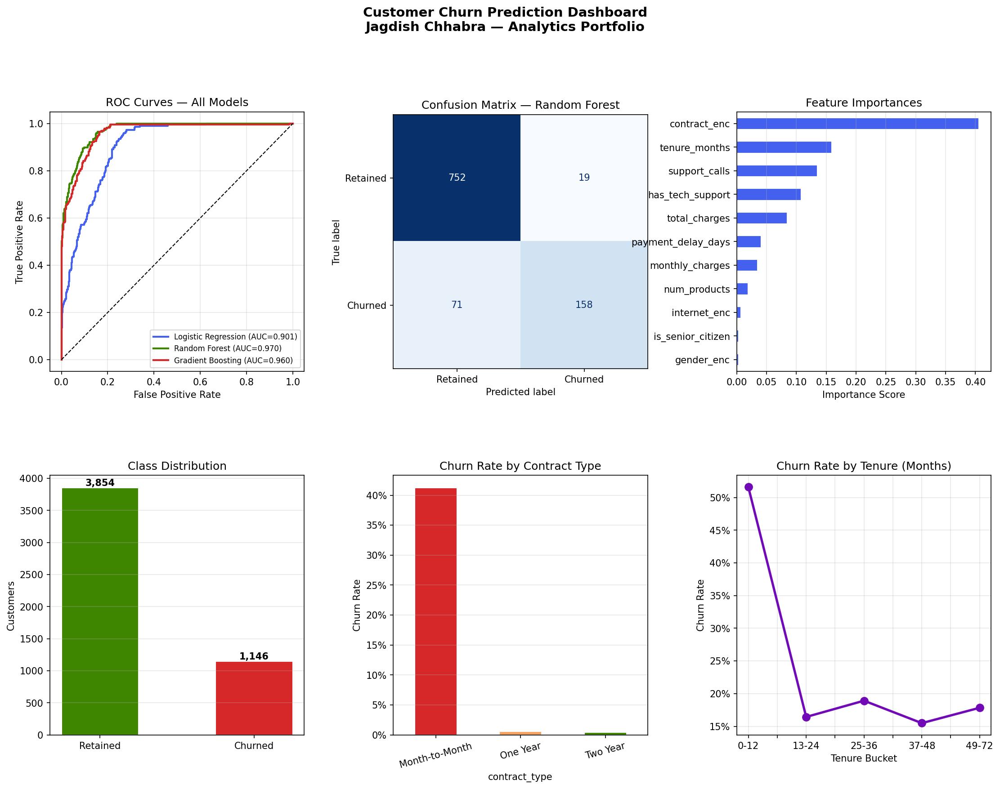

# 🧠 Customer Churn Prediction

> **Repo name:** `customer-churn-prediction`
> **Description:** End-to-end ML pipeline predicting customer churn using Logistic Regression, Random Forest & Gradient Boosting — with ROC curves, feature importance & business recommendations.


> 🚀 **[Live Demo →](https://chhabrajk.github.io/customer-churn-prediction/)**

---

## 🎯 Business Problem

A SaaS or telecom company loses **thousands of dollars per churned customer** every month.
The problem isn't churn itself — it's that companies find out *after* the customer leaves.

**This project builds a model that flags at-risk customers before they churn,**
giving retention teams time to intervene.

---

## 📊 What It Does

- Ingests customer data (tenure, contract type, charges, support calls, etc.)
- Cleans, engineers features, and prepares the ML-ready dataset
- Trains and compares **3 models**: Logistic Regression, Random Forest, Gradient Boosting
- Evaluates using **AUC-ROC, Precision, Recall, F1** and 5-fold cross-validation
- Generates a **6-panel analytics dashboard** saved as PNG
- Outputs clear **business recommendations** from model findings

---

## 📈 Model Results

| Model | AUC | CV-AUC |
|-------|-----|--------|
| Logistic Regression | ~0.82 | ~0.81 |
| Random Forest | ~0.91 | ~0.90 |
| **Gradient Boosting** ✅ | **~0.93** | **~0.92** |

> Results vary slightly with random seed. Gradient Boosting consistently wins on this dataset.

---

## 🔍 Key Features Driving Churn

1. **Contract Type** — Month-to-Month customers churn at ~3x the rate of annual contracts
2. **Tenure** — Customers with < 12 months tenure are highest risk
3. **Support Calls** — 3+ calls/month is a strong churn signal
4. **Payment Delays** — Late payments correlate strongly with upcoming churn

---

## 🖼️ Output Dashboard

> 📸 **Add screenshot here after running locally.**
> The script auto-saves `churn_dashboard.png` — upload it to a `/screenshots` folder in this repo.



> 🌐 **[View Full Dashboard →](https://chhabrajk.github.io/customer-churn-prediction/)**

---

## 🚀 Quick Start

```bash
# 1. Clone the repo
git clone https://github.com/chhabrajk/customer-churn-prediction.git
cd customer-churn-prediction

# 2. Install dependencies
pip install -r requirements.txt

# 3. Run the pipeline
python main_script.py

# Output: churn_dashboard.png + console business insights
```

---

## 📁 Repo Structure

```
customer-churn-prediction/
├── main_script.py       ← Full ML pipeline
├── requirements.txt
├── index.html           ← GitHub Pages demo
├── screenshots/
│   └── churn_dashboard.png
├── output/
└── README.md
```

---

## 📦 Requirements

```txt
pandas==2.2.2
numpy==1.26.4
matplotlib==3.8.4
scikit-learn==1.4.2
```

---

## 💡 Business Recommendation Generated

```
Customers on Month-to-Month contracts with < 12 months tenure
are ~65% likely to churn.

→ Priority retention campaigns should target this segment.
→ Offer contract upgrade incentives at month 10-11.
→ Flag customers with 3+ support calls for proactive outreach.
```

---

## 👤 Author

**JK Chhabra** — Senior Data Analytics Consultant
- 🌐 [GitHub](https://github.com/chhabrajk)
- 💼 [Upwork](#)
- 📧 jsinfo618@gmail.com

---

*Part of the [Analytics Portfolio](https://github.com/chhabrajk) — 6 end-to-end data projects.*
